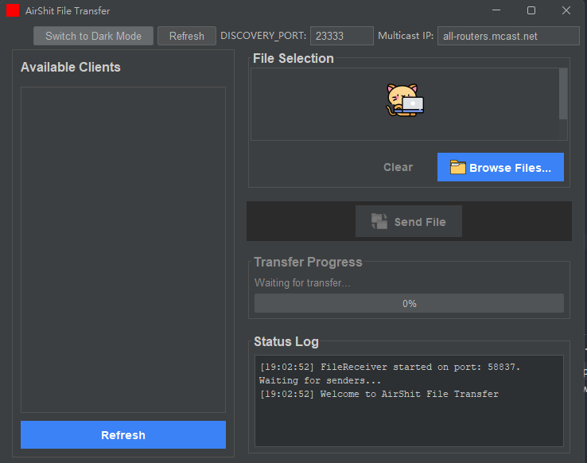
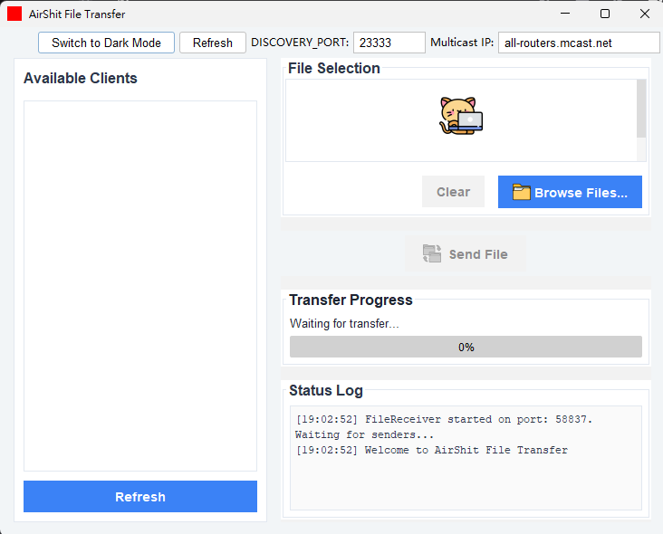
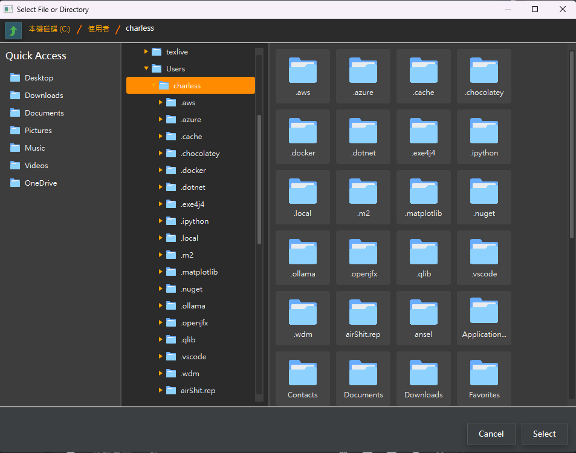

# AirShit - Local Area Network P2P File Transfer Tool

[中文](README_zh_tw.md)

=====================================================

Version: 1.4.0

Last Updated: 2025-05-30

=====================================================

## Introduction

### image





AirShit is a peer-to-peer (P2P) file transfer application designed specifically
for Local Area Network (LAN) environments. It utilizes the TCP protocol for
stable and reliable file transfers and employs UDP multicast technology for
automatic discovery and heartbeat maintenance of other AirShit nodes within the LAN.

This application supports the transfer of single files, multiple files, and
entire folders (including their subdirectories and files). To enhance the
transfer efficiency of large files, AirShit segments large files into multiple
chunks based on the number of CPU cores and utilizes multi-threading for
parallel transmission.

The Graphical User Interface (GUI) is implemented using Java Swing technology,
providing intuitive file selection, a list of available online nodes, clear
upload and download progress bars, and detailed status logging, making it
convenient for users to track the transfer process.

## Main Features

1.  **Automatic Node Discovery and Maintenance:**

    - Uses UDP Multicast (default address: 239.255.42.99, default port: 50000)
      to broadcast `HELLO` messages within the LAN to announce its presence.
    - Periodically sends `HEARTBEAT` messages and listens for responses from
      other nodes to maintain a real-time list of online nodes.
    - Automatically removes nodes that do not respond within a timeout period
      from the list.

2.  **Peer-to-Peer (P2P) Direct Transfer:**

    - File transfers establish a direct TCP connection between the sender and
      receiver.
    - Rigorous transfer process: Establish connection -> Send file metadata
      (filename, size, etc.) -> Receiver acknowledgment (ACK) -> Segmented
      transfer of file content -> Wait for receiver acknowledgment after each
      segment transfer -> Final confirmation after all segments are transferred.

3.  **Support for Multiple Files and Folder Transfers:**

    - Users can select a single file for sending via the GUI.
    - Supports selecting an entire folder; the application will recursively
      include all files and subfolder structures within the folder for transfer.

4.  **Multi-threaded Parallel Transfer:**

    - For larger files, the file is divided into multiple chunks based on the
      current system's CPU core count.
    - Each chunk is handled by an independent thread for transfer, enabling
      parallel processing and effectively increasing the transfer speed of
      large files.

5.  **Graphical User Interface (GUI):**
    - Developed with Java Swing, providing a cross-platform graphical interface.
    - **Node List (ClientPanel):** Dynamically displays other AirShit users
      detected on the LAN.
    - **File Selection (FileSelectionPanel):** Allows users to easily browse
      and select files or folders to send.
    - **Transfer Control (SendControlPanel):** Contains the "Send" button,
      enabled/disabled based on whether a file and target client are selected.
    - **Progress Display (ReceiveProgressPanel):** Shows the progress percentage
      of file reception or transmission as a progress bar.
    - **Status Log (LogPanel):** Outputs real-time application status, node
      discovery, file transfer events, and potential error messages.
    - **Light/Dark Mode Toggle:** Provides a button for users to switch
      between light and dark interface themes, enhancing user experience.

## Project Structure

```
AirShit/
├── README.md                          
├── README_zh_tw.md                    
├── pom.xml                            
├── img/                               
│   ├── dark.png                       
│   ├── light.png                      
│   └── fileexp.png                    
│
└── src/
    └── main/
        ├── java/
        │   └── AirShit/               
        │       ├── Main.java          
        │       ├── Client.java         
        │       ├── TransferCallback.java 
        │       │
        │       ├── 📁 Network Layer 
        │       ├── FileReceiver.java框)
        │       ├── FileSender.java   
        │       ├── ReceiverOptimized.java
        │       ├── SendFileOptimized.java
        │       │
        │       ├── 📁 File Processing 
        │       ├── TarCompressor.java 
        │       ├── TarExtractor.java  
        │       ├── ChunkInfo.java     
        │       │
        │       ├── 📁 Utilities 
        │       ├── FolderSelector.java
        │       ├── GenerateTestFolder.java 
        │       ├── NoFileSelectedException.java 
        │       │
        │       ├── 📁 GUI Layer 
        │       ├── SendFileGUI.java    
        │       │
        │       └── ui/                 
        │           ├── LogPanel.java           
        │           ├── ClientPanel.java        
        │           ├── FileSelectionPanel.java 
        │           ├── SendControlPanel.java   
        │           ├── ReceiveProgressPanel.java 
        │           ├── AnimationUtils.java     
        │           ├── FileChooserDialog.java  
        │           └── FXFileChooserAdapter.java 
        │
        └── resources/                  
            ├── asset/                  
            │   ├── data-transfer.png   
            │   ├── folder.png          
            │   ├── kitty.icns          
            │   ├── kitty.ico           
            │   └── kitty.png           
            │
            ├── css/                    
            │   ├── dark-theme.css      
            │   └── file-chooser-dialog.css
            │
            └── icons/
                ├── up-arrow.png
                └── slash.png   
```


(Note: The .class file list above is inferred from the provided folder content.
The actual compilation result might differ slightly, e.g.,
SendFileGUI$ClientCellRenderer.class should be under the ui/ subdirectory.)

## Build and Execution

### Prerequisites

- **Java Development Kit (JDK):** Version 8 or higher. JDK 11 or newer is
  recommended for full `jpackage` tool support (for packaging).
- **Git (Optional):** If you need to pull code from a version control system
  or push updates.
- **Operating System:** Windows, macOS, or Linux.

### General Build and Execution Steps (Using Provided Scripts)

#### Linux / macOS / Windows (Using PowerShell)

Use maven to compile and run

```
mvn compile javafx:java
```

#### require

allow your ipv6 network interface

## Issues

- **Firewall:** Ensure your operating system's firewall allows communication
  on the TCP ports used by AirShit (dynamically allocated for file transfer)
  and UDP port (default 50000, for node discovery).
- **Network Interface:** On systems with multiple network interfaces, UDP
  multicast might require correct configuration or selection of a specific
  network interface to work properly. `Main.java`'s
  `findCorrectNetworkInterface()` attempts to handle this.
- **Encoding:** The application internally and the build scripts specify UTF-8
  encoding to ensure correct handling of cross-platform file names and messages.
- **jpackage (Packaging):** The `jpackage` tool is part of JDK 14 and later.
  The `packing` feature might not be available if using an older JDK.

### packing

```windows
mvn clean package
jpackage --type exe `
             --dest "dist" `
             --input "target"`
             --name "AirShit" `
             --main-jar AirShit-1.0-SNAPSHOT.jar `
             --java-options "-Dfile.encoding=UTF-8" `
             --app-version 1.0.0 `
             --vendor "AirShit Project" `
             --win-menu `
             --win-shortcut `
             --icon ".\src\main\resources\asset\kitty.png"
```

### packing_for_mac

```windows
mvn clean package
jpackage --type dmg \
             --dest ./dist \
             --input target \
             --name "AirShit" \
             --main-jar AirShit-1.0-SNAPSHOT.jar \
             --java-options "-Xmx512m" \
             --app-version 1.2.0 \
             --vendor "AirShit Project" \
             --icon src/main/resources/asset/kitty.icns
```
